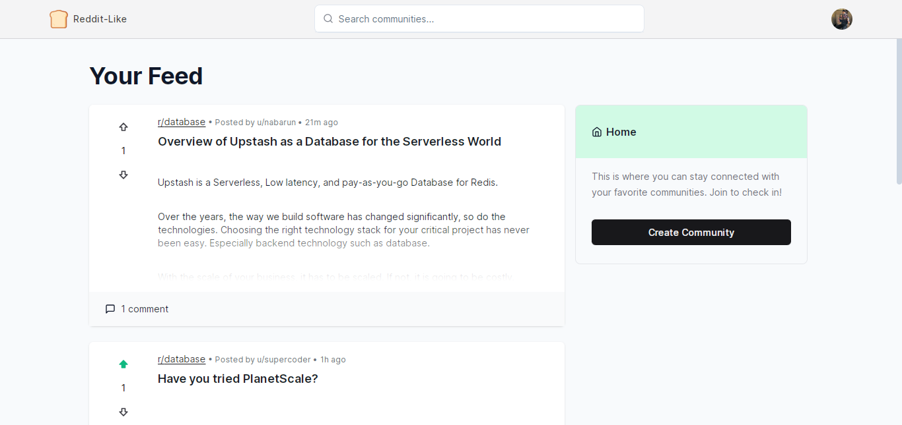

# Reddit-Like

A powerful web application built with the T3 stack. This platform mirrors the core functionalities of Reddit, offering a seamless user experience for content creation, discussion, and community engagement.

## Screenshot



<p align="center">
  <a href="https://reddit-like.nabarun.app"><strong>View Project »</strong></a>
</p>

## Running Locally

This application requires Node.js v16.13+.

### Cloning the repository to the local machine:

```bash
git clone https://github.com/nabarvn/reddit-like.git
cd reddit-like
```

### Installing the dependencies:

```bash
npm install
```

### Running the application:

```bash
npm run dev
```

## Tech Stack:

- **Language**: [TypeScript](https://www.typescriptlang.org)
- **Framework**: [Next.js](https://nextjs.org)
- **Styling**: [Tailwind CSS](https://tailwindcss.com)
- **Analytics**: [Vercel Analytics](https://vercel.com/analytics)
- **State Management**: [React Query](https://www.npmjs.com/package/@tanstack/react-query)
- **ORM Toolkit**: [Prisma](https://www.prisma.io/docs/concepts/overview/what-is-prisma)
- **Caching Layer**: [Upstash](https://docs.upstash.com/redis)
- **MySQL Database**: [Aiven](https://aiven.io/docs/get-started)
- **Authentication**: [NextAuth.js](https://next-auth.js.org/getting-started/introduction)
- **File Hosting**: [UploadThing](https://docs.uploadthing.com)
- **Deployment**: [Vercel](https://vercel.com)

## Credits

Learned a ton while building this project. All thanks to Josh for the next level (no pun intended) tutorial!

<hr />

<div align="center">Don't forget to leave a STAR 🌟</div>
